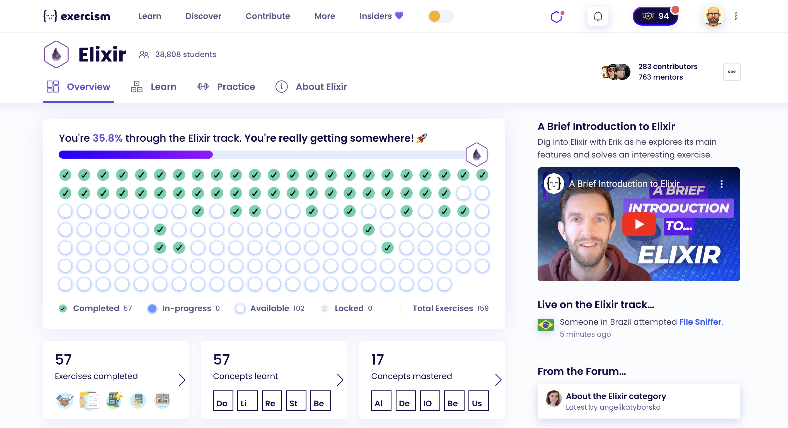

# Exercism

My last 5 exercises. Three of them I have solved for this activity, and two of them I have only revised. I have finished the learning path of Elixir language in Exercism. :)

* [File Sniffer](file-sniffer)
* [Language List](language-list)
* [Log Parser](log-parser)
* [Paint By Number](paint-by-number)
* [Take a Number Deluxe](take-a-number-deluxe)

